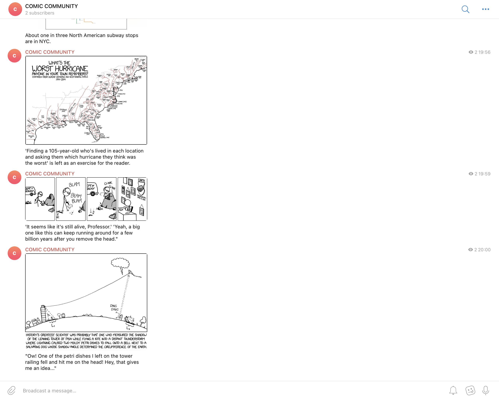

# XKCD Telegram Poster

Автоматический скрипт для публикации случайных комиксов [xkcd](https://xkcd.com) в Telegram-канал с подписью.



## Возможности

- Скачивает **случайный комикс**
- Публикует в **Telegram-канал**
- Добавляет **подпись `alt`** автора комикса
- После публикации — **удаляет изображение и JSON**

## Установка
Перед запуском убедитесь, что установлены:
- **Python 3.8 - 3.11**

**Скачайте репозиторий**
```bash
git clone https://github.com/1ns0mn1a7/XKCD-Telegram-Poster
cd xkcd-telegram-poster
```

**Создайте окружение и установите зависимости**
```bash
python3 -m venv venv
source venv/bin/activate
pip install -r requirements.txt
```

Создайте `.env` в корне:
- `TELEGRAM_BOT_TOKEN` - создайте бота через [BotFather](https://telegram.me/BotFather), после укажите токен вашего бота.
- `TELEGRAM_CHANNEL_ID` - добавьте бота администратором в ваш Телеграм-канал и укажите ссылку в виде `@example_link`.

## Запуск

```bash
python post_to_telegram_channel.py
```

Комикс будет отправлен в канал, и файлы будут автоматически удалены.

## Цель проекта

Код написан в образовательных целях на онлайн-курсе для веб-разработчиков [dvmn.org](dvmn.org).

## Лицензия

Проект лицензирован [MIT License](https://opensource.org/licenses/MIT). Полный текст лицензии доступен в файле `LICENSE`.